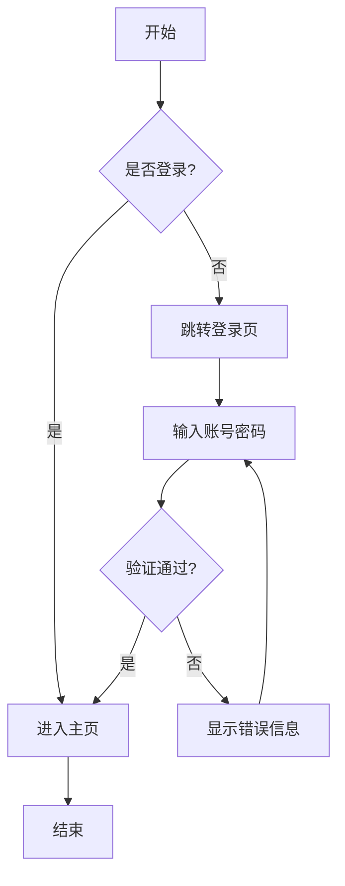
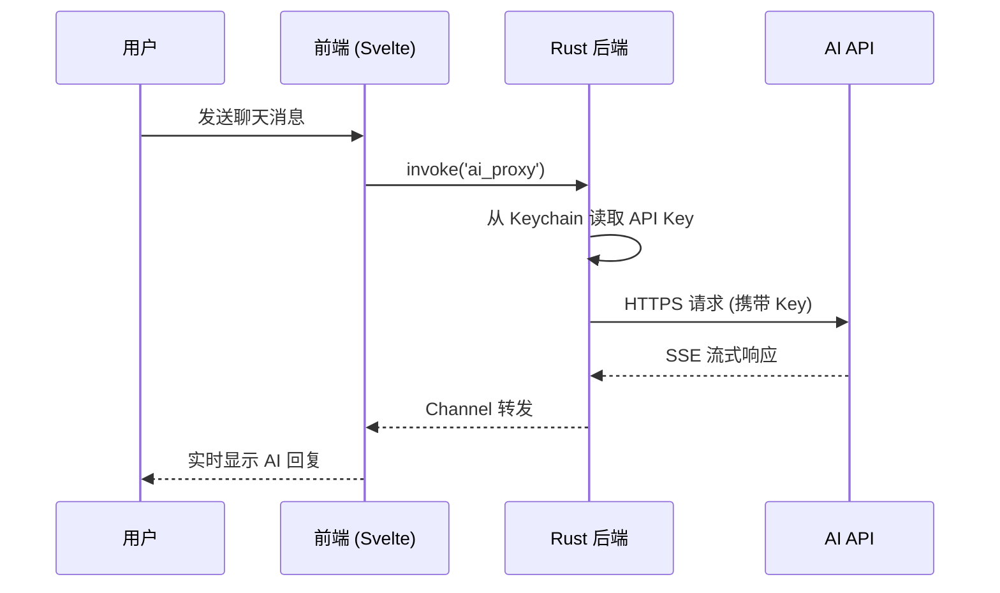
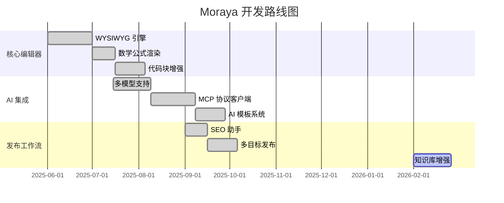
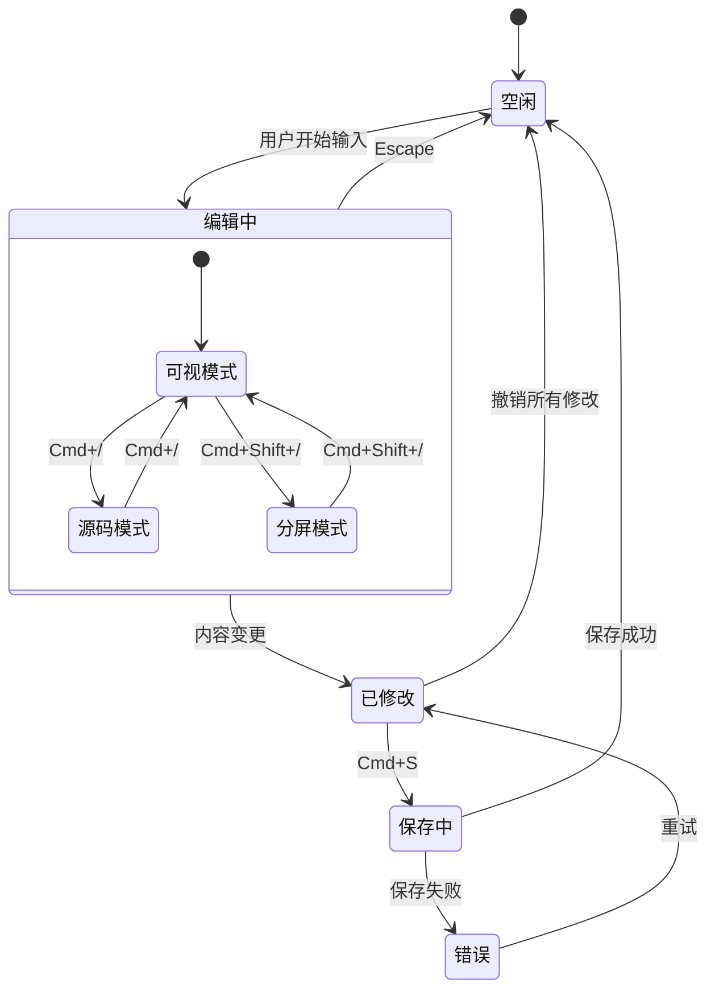
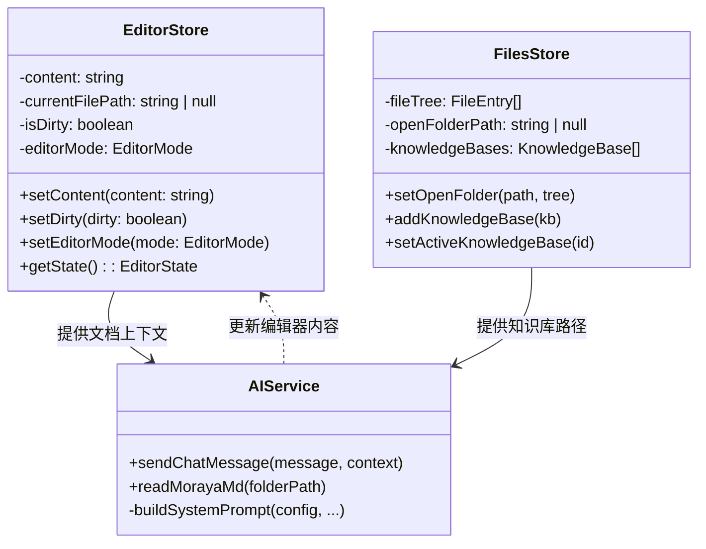
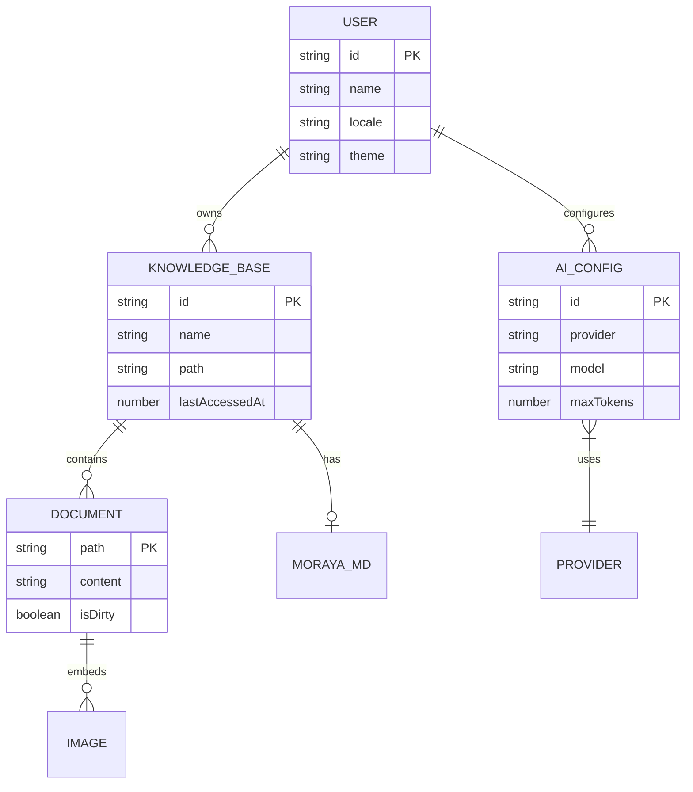
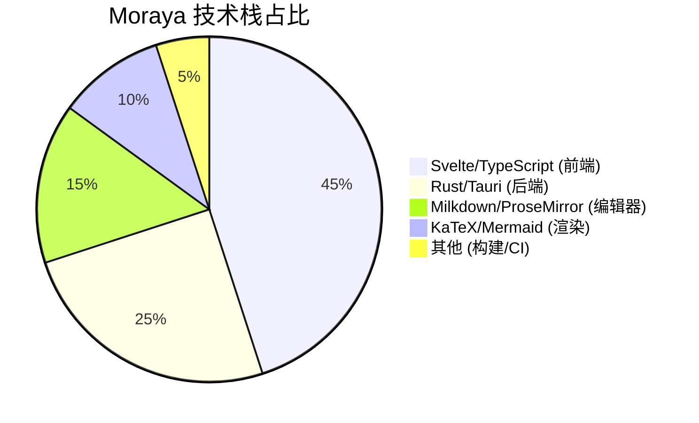
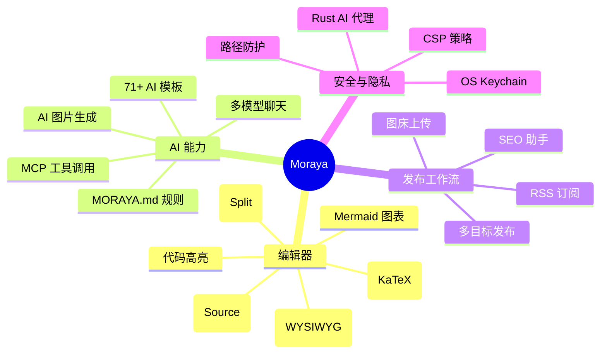
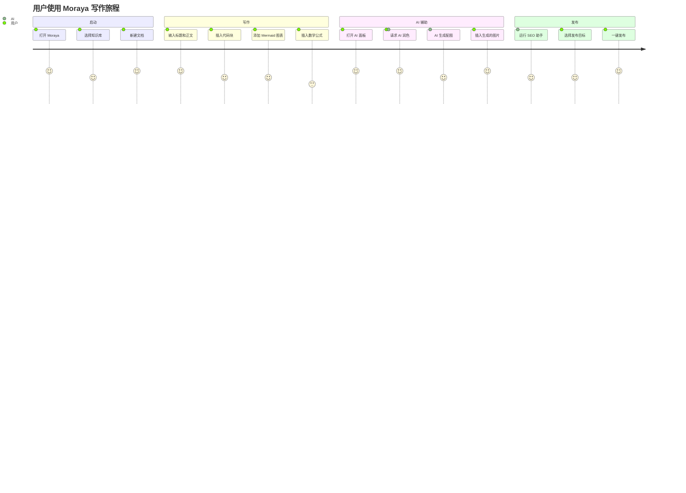

# Moraya Markdown 语法完整参考

> 本文档覆盖 Moraya 编辑器支持的**全部** Markdown 语法，可作为语法规则参考文件，也可作为 AI 提取规则的依据文档。

---

## 1. 标题 (Headings)

Moraya 支持 H1 至 H6 共 6 级标题，快捷键 `Cmd+1` 至 `Cmd+6`。

# 一级标题 (H1)

## 二级标题 (H2)

### 三级标题 (H3)

#### 四级标题 (H4)

##### 五级标题 (H5)

###### 六级标题 (H6)

---

## 2. 段落与换行

普通段落之间使用空行分隔。

这是第一个段落。段落内的文字会自动换行，不需要手动添加换行符。

这是第二个段落。两个段落之间必须有一个空行。

行尾添加两个空格
可以在段落内产生换行（软换行 / `<br>`）。

也可以在行尾使用反斜杠\
产生换行效果。

---

## 3. 文本格式 (Inline Formatting)

### 粗体

**这是粗体文本** — 使用 `**text**` 语法，快捷键 `Cmd+B`

### 斜体

*这是斜体文本* — 使用 `*text*` 语法，快捷键 `Cmd+I`

### 粗斜体

***这是粗斜体文本*** — 使用 `***text***` 语法

### 删除线

~~这是删除线文本~~ — 使用 `~~text~~` 语法，快捷键 `Cmd+Shift+D`

### 内联代码

`console.log('Hello')` — 使用反引号包裹，快捷键 `` Cmd+` ``

### 组合使用

这段文字包含**粗体**、*斜体*、~~删除线~~和`内联代码`的组合使用。

---

## 4. 链接 (Links)

### 基础链接

[Moraya 官网](https://github.com/nicepkg/moraya)

### 带标题的链接

[Moraya 官网](https://github.com/nicepkg/moraya "Moraya GitHub 仓库")

### 自动链接

<https://github.com/nicepkg/moraya>

### 邮件链接

<contact@example.com>

快捷键：`Cmd+K` 插入链接

---

## 5. 图片 (Images)

### 基础图片


### 带标题的图片


### 带宽度控制的图片

Moraya 支持通过 `width` 属性控制图片缩放比例：


快捷键：`Cmd+Shift+G` 插入图片

---

## 6. 列表 (Lists)

### 无序列表

- 苹果
- 香蕉
- 橙子

### 有序列表

1. 第一步：安装依赖
2. 第二步：配置环境
3. 第三步：启动项目

### 嵌套列表

- 水果
  - 苹果
    - 红富士
    - 金帅
  - 香蕉
- 蔬菜
  - 番茄
  - 黄瓜

### 嵌套有序列表

1. 前端技术
   1. HTML
   2. CSS
   3. JavaScript
2. 后端技术
   1. Rust
   2. Go
   3. Python

### 任务列表

- [x] 完成核心编辑器开发
- [x] 集成 AI 多模型支持
- [x] 实现 MCP 协议客户端
- [ ] 添加 PDF 导出功能
- [ ] 支持协同编辑

快捷键：
- `Cmd+Shift+U` — 无序列表
- `Cmd+Shift+L` — 有序列表
- `Cmd+Shift+X` — 任务列表
- `Cmd+]` / `Cmd+[` — 增加/减少缩进

---

## 7. 引用 (Blockquotes)

### 单层引用

> Moraya — 隐私优先的 AI 时代极简 Markdown 编辑器。

### 多段引用

> 第一段引用内容。
>
> 第二段引用内容。

### 嵌套引用

> 外层引用
>
> > 内层引用
> >
> > > 第三层引用

### 引用内包含其他格式

> **注意**：引用内可以使用各种格式：
>
> - 列表项一
> - 列表项二
>
> 也可以包含`内联代码`和 *斜体* 文本。

快捷键：`Cmd+Shift+Q`

---

## 8. 水平分割线 (Horizontal Rules)

三种写法均可：

---

***

___

---

## 9. 表格 (Tables)

### 基础表格

| 功能 | 描述 | 状态 |
|------|------|------|
| WYSIWYG 编辑 | 所见即所得的 Markdown 编辑 | 已完成 |
| AI 对话 | 多模型流式 AI 聊天 | 已完成 |
| MCP 协议 | 三种传输方式支持 | 已完成 |

### 列对齐

| 左对齐 | 居中对齐 | 右对齐 |
|:-------|:-------:|-------:|
| 苹果 | 5.00 | 25.00 |
| 香蕉 | 3.50 | 17.50 |
| 橙子 | 4.20 | 21.00 |
| **合计** | — | **63.50** |

快捷键：`Cmd+Shift+T` 插入表格。Moraya 提供浮动工具栏，支持添加/删除行列、调整对齐。

---

## 10. 代码块 (Code Blocks)

Moraya 支持 23+ 种编程语言的语法高亮，带有语言选择器、复制按钮和语言标签。

### JavaScript

```javascript
function fibonacci(n) {
  if (n <= 1) return n;
  return fibonacci(n - 1) + fibonacci(n - 2);
}

console.log(fibonacci(10)); // 55
```

### TypeScript

```typescript
interface User {
  id: string;
  name: string;
  email: string;
}

const getUser = async (id: string): Promise<User> => {
  const response = await fetch(`/api/users/${id}`);
  return response.json();
};
```

### Python

```python
from dataclasses import dataclass
from typing import List

@dataclass
class Article:
    title: str
    content: str
    tags: List[str]

    def word_count(self) -> int:
        return len(self.content.split())
```

### Java

```java
public class HelloWorld {
    public static void main(String[] args) {
        List<String> languages = List.of("Java", "Rust", "Go");
        languages.stream()
            .filter(lang -> lang.length() > 2)
            .forEach(System.out::println);
    }
}
```

### Go

```go
package main

import "fmt"

func main() {
    ch := make(chan string, 2)
    ch <- "Hello"
    ch <- "World"
    fmt.Println(<-ch)
    fmt.Println(<-ch)
}
```

### Rust

```rust
use std::collections::HashMap;

fn word_frequency(text: &str) -> HashMap<&str, usize> {
    let mut map = HashMap::new();
    for word in text.split_whitespace() {
        *map.entry(word).or_insert(0) += 1;
    }
    map
}
```

### C

```c
#include <stdio.h>

int main() {
    int arr[] = {5, 3, 8, 1, 9};
    int n = sizeof(arr) / sizeof(arr[0]);
    for (int i = 0; i < n; i++) {
        printf("%d ", arr[i]);
    }
    return 0;
}
```

### C++

```cpp
#include <iostream>
#include <vector>
#include <algorithm>

int main() {
    std::vector<int> nums = {5, 3, 8, 1, 9};
    std::sort(nums.begin(), nums.end());
    for (const auto& n : nums) {
        std::cout << n << " ";
    }
    return 0;
}
```

### Ruby

```ruby
class Animal
  attr_reader :name, :sound

  def initialize(name, sound)
    @name = name
    @sound = sound
  end

  def speak
    "#{name} says #{sound}!"
  end
end

cat = Animal.new("Cat", "Meow")
puts cat.speak
```

### PHP

```php
<?php
function findPrimes(int $limit): array {
    $primes = [];
    for ($i = 2; $i <= $limit; $i++) {
        $isPrime = true;
        for ($j = 2; $j * $j <= $i; $j++) {
            if ($i % $j === 0) { $isPrime = false; break; }
        }
        if ($isPrime) $primes[] = $i;
    }
    return $primes;
}

print_r(findPrimes(30));
```

### Swift

```swift
struct Point {
    var x: Double
    var y: Double

    func distance(to other: Point) -> Double {
        let dx = x - other.x
        let dy = y - other.y
        return (dx * dx + dy * dy).squareRoot()
    }
}

let a = Point(x: 0, y: 0)
let b = Point(x: 3, y: 4)
print(a.distance(to: b)) // 5.0
```

### Kotlin

```kotlin
data class Task(val name: String, val done: Boolean)

fun main() {
    val tasks = listOf(
        Task("Write code", true),
        Task("Run tests", false),
        Task("Deploy", false)
    )
    val pending = tasks.filter { !it.done }
    println("Pending: ${pending.map { it.name }}")
}
```

### SQL

```sql
SELECT
    u.name,
    COUNT(o.id) AS order_count,
    SUM(o.total) AS total_spent
FROM users u
LEFT JOIN orders o ON u.id = o.user_id
WHERE u.created_at >= '2025-01-01'
GROUP BY u.id, u.name
HAVING COUNT(o.id) > 5
ORDER BY total_spent DESC
LIMIT 10;
```

### Bash

```bash
#!/bin/bash
set -euo pipefail

for dir in */; do
    if [ -f "$dir/package.json" ]; then
        echo "Installing deps in $dir"
        (cd "$dir" && pnpm install)
    fi
done
echo "All done!"
```

### JSON

```json
{
  "name": "moraya",
  "version": "0.12.0",
  "description": "AI-era minimalist Markdown editor",
  "dependencies": {
    "@milkdown/core": "^7.18.0",
    "svelte": "^5.0.0"
  }
}
```

### YAML

```yaml
name: Build & Release
on:
  push:
    tags: ['v*']
jobs:
  build:
    runs-on: ${{ matrix.os }}
    strategy:
      matrix:
        os: [macos-latest, windows-latest, ubuntu-latest]
    steps:
      - uses: actions/checkout@v4
      - run: pnpm install
      - run: pnpm tauri build
```

### HTML

```html
<!DOCTYPE html>
<html lang="zh-CN">
<head>
    <meta charset="UTF-8">
    <title>Moraya</title>
    <link rel="stylesheet" href="styles.css">
</head>
<body>
    <div id="app">
        <h1>Hello Moraya</h1>
    </div>
</body>
</html>
```

### CSS

```css
:root {
    --accent-color: #007aff;
    --bg-primary: #ffffff;
    --text-primary: #1d1d1f;
}

.editor {
    font-family: -apple-system, BlinkMacSystemFont, sans-serif;
    line-height: 1.6;
    color: var(--text-primary);
    max-width: 800px;
    margin: 0 auto;
}
```

### Markdown

```markdown
# 文章标题

> 这是一段引用

- 列表项 1
- 列表项 2

**粗体** 和 *斜体*
```

### SCSS

```scss
$primary: #007aff;
$radius: 8px;

.button {
    background: $primary;
    border-radius: $radius;
    padding: 0.5rem 1rem;

    &:hover {
        background: darken($primary, 10%);
    }

    &--large {
        padding: 1rem 2rem;
        font-size: 1.2rem;
    }
}
```

### Lua

```lua
function factorial(n)
    if n <= 1 then
        return 1
    end
    return n * factorial(n - 1)
end

for i = 1, 10 do
    print(string.format("%2d! = %d", i, factorial(i)))
end
```

### Diff

```diff
- const oldFunction = () => {
-     return "old behavior";
- };
+ const newFunction = () => {
+     return "new behavior";
+ };
```

### Plain Text

```text
这是一段纯文本内容，不会进行任何语法高亮。
可以用于显示日志输出、配置说明等。
```

快捷键：`Cmd+Shift+K` 插入代码块

---

## 11. 数学公式 (Math — KaTeX)

### 内联公式

质能方程 $E = mc^2$ 是物理学中最著名的公式。

勾股定理：$a^2 + b^2 = c^2$

欧拉公式：$e^{i\pi} + 1 = 0$

### 块级公式

#### 二次方程求根公式

$$
x = \frac{-b \pm \sqrt{b^2 - 4ac}}{2a}
$$

#### 求和公式

$$
\sum_{i=1}^{n} i = \frac{n(n+1)}{2}
$$

#### 积分

$$
\int_{0}^{\infty} e^{-x^2} dx = \frac{\sqrt{\pi}}{2}
$$

#### 矩阵

$$
A = \begin{pmatrix}
a_{11} & a_{12} & a_{13} \\
a_{21} & a_{22} & a_{23} \\
a_{31} & a_{32} & a_{33}
\end{pmatrix}
$$

#### 希腊字母

$$
\alpha, \beta, \gamma, \delta, \epsilon, \zeta, \eta, \theta, \lambda, \mu, \pi, \sigma, \phi, \omega
$$

#### 极限

$$
\lim_{x \to 0} \frac{\sin x}{x} = 1
$$

#### 分段函数

$$
f(x) = \begin{cases}
x^2 & \text{if } x \geq 0 \\
-x & \text{if } x < 0
\end{cases}
$$

#### 连分数

$$
\phi = 1 + \cfrac{1}{1 + \cfrac{1}{1 + \cfrac{1}{1 + \cdots}}}
$$

快捷键：`Cmd+Shift+M` 插入数学公式块

---

## 12. Mermaid 图表

Moraya 支持 9 种 Mermaid 图表类型，使用 `` ```mermaid `` 代码块触发。图表支持编辑/预览双模式切换，自动适配明暗主题。

### 12.1 流程图 (Flowchart)



### 12.2 时序图 (Sequence Diagram)



### 12.3 甘特图 (Gantt Chart)



### 12.4 状态图 (State Diagram)



### 12.5 类图 (Class Diagram)



### 12.6 ER 图 (Entity Relationship Diagram)



### 12.7 饼图 (Pie Chart)



### 12.8 思维导图 (Mindmap)



### 12.9 用户旅程图 (Journey Diagram)



---

## 13. Emoji 表情

Moraya 支持通过短代码输入 emoji，输入 `:shortcode:` 后自动转换为对应表情。

### 常用 Emoji 短代码参考

| 类别 | 短代码 | 效果 |
|------|--------|------|
| 表情 | `:smile:` | :smile: |
| 表情 | `:laughing:` | :laughing: |
| 表情 | `:heart_eyes:` | :heart_eyes: |
| 表情 | `:thinking:` | :thinking: |
| 手势 | `:thumbsup:` | :thumbsup: |
| 手势 | `:thumbsdown:` | :thumbsdown: |
| 手势 | `:clap:` | :clap: |
| 手势 | `:wave:` | :wave: |
| 符号 | `:heart:` | :heart: |
| 符号 | `:star:` | :star: |
| 符号 | `:fire:` | :fire: |
| 符号 | `:checkmark:` | :checkmark: |
| 物品 | `:rocket:` | :rocket: |
| 物品 | `:bulb:` | :bulb: |
| 物品 | `:book:` | :book: |
| 物品 | `:computer:` | :computer: |
| 自然 | `:sun_with_face:` | :sun_with_face: |
| 自然 | `:rainbow:` | :rainbow: |
| 自然 | `:cherry_blossom:` | :cherry_blossom: |
| 标志 | `:warning:` | :warning: |
| 标志 | `:x:` | :x: |
| 标志 | `:white_check_mark:` | :white_check_mark: |
| 标志 | `:arrow_right:` | :arrow_right: |

支持 2000+ emoji 短代码，完整列表参见 [node-emoji](https://github.com/omnidan/node-emoji)。

---

## 14. 定义列表 (Definition Lists)

Moraya
:   隐私优先的 AI 时代极简 Markdown 编辑器

Milkdown
:   基于 ProseMirror 的 Markdown WYSIWYG 编辑器框架

Tauri
:   使用 Rust 构建的轻量级跨平台桌面应用框架
:   与 Electron 相比体积更小、性能更高

MCP
:   Model Context Protocol，模型上下文协议
:   用于 AI 与外部工具之间的标准化通信

语法规则：术语独占一行，定义以 `:   `（冒号 + 3个空格）开头。一个术语可以有多个定义段落。

---

## 15. Frontmatter (YAML 前置元数据)

Moraya 支持 YAML frontmatter，位于文档最顶部，用 `---` 包裹。Frontmatter 在保存时会被保留，不会被编辑器渲染。

```yaml
---
title: 文章标题
date: 2026-02-24
author: 作者名
tags:
  - Markdown
  - AI
  - 编辑器
description: 这是一篇关于 Moraya 编辑器的介绍文章
slug: moraya-introduction
---
```

---

## 16. Image Prompts (Moraya 特有语法)

Moraya 支持在文档中嵌入 AI 图片生成提示词，使用特殊的 `image-prompts` 代码块。这些代码块在导出时会被自动移除。

### 格式一：JSON 结构化格式

```image-prompts
[
  {
    "prompt": "A minimalist workspace with a laptop showing a Markdown editor, soft natural lighting, clean desk, professional photography",
    "target": 0,
    "reason": "Opening visual for the introduction section"
  },
  {
    "prompt": "Abstract visualization of AI neural network connecting to multiple data sources, blue and purple gradient, modern tech illustration",
    "target": 3,
    "reason": "Illustrates the AI integration architecture"
  }
]
```

**JSON 字段说明：**

| 字段 | 类型 | 必填 | 说明 |
|------|------|------|------|
| `prompt` | string | 是 | 英文图片生成提示词 |
| `target` | number | 否 | 目标段落索引（从 0 开始），默认 0 |
| `reason` | string | 否 | 为什么这张图适合放在这个位置 |

### 格式二：纯文本格式（单个提示词）

```image-prompt
A close-up portrait of a developer working at a minimalist desk, warm ambient lighting, professional editorial photography style
```

### 格式三：纯文本格式（多个提示词，用 `---` 分隔）

```image-prompts
A serene mountain landscape at sunrise, panoramic view, oil painting style, warm golden tones
---
Modern minimalist office interior with floor-to-ceiling windows, architectural photography, bright and airy
---
Abstract data flow visualization with glowing particles and connecting lines, dark background, futuristic tech art
---
Cozy reading nook with bookshelves, warm lamplight, watercolor illustration style, soft and inviting atmosphere
```

### 图片生成模式与风格

Moraya 支持 6 种图片生成模式，每种模式有 10 种风格：

| 模式 | 说明 | 可用风格 |
|------|------|---------|
| `article` | 文章配图 | auto, photo, illustration, flat, ink, watercolor, isometric, infographic, editorial, cartoon |
| `design` | 产品设计 | auto, render, sketch, blueprint, clay, wireframe, exploded, section, cad, prototype |
| `storyboard` | 故事板 | auto, anime, comic, cinematic, watercolor, pixel, noir, manga, cartoon, realistic |
| `product` | 商品摄影 | auto, studio, lifestyle, flatlay, macro, minimalist, packaging, outdoor, editorial, mood |
| `moodboard` | 情绪板 | auto, abstract, texture, gradient, collage, vintage, botanical, geometric, ethereal, brutalist |
| `portrait` | 人物肖像 | auto, portrait, headshot, fullbody, fashion, street, cinematic, glamour, environmental, candid |

### 图片尺寸与比例

| 比例 | 大 (Large) | 中 (Medium) | 小 (Small) |
|------|-----------|-------------|------------|
| 16:9 | 1920x1080 | 1280x720 | 960x540 |
| 4:3 | 1600x1200 | 1024x768 | 800x600 |
| 3:2 | 1536x1024 | 1200x800 | 768x512 |
| 1:1 | 1536x1536 | 1024x1024 | 512x512 |
| 2:3 | 1024x1536 | 800x1200 | 512x768 |
| 3:4 | 1200x1600 | 768x1024 | 600x800 |
| 9:16 | 1080x1920 | 720x1280 | 540x960 |

---

## 17. 键盘快捷键完整参考

### 文件操作

| 操作 | macOS | Windows/Linux |
|------|-------|---------------|
| 新建文件 | `Cmd+N` | `Ctrl+N` |
| 新建窗口 | `Cmd+Shift+N` | `Ctrl+Shift+N` |
| 打开文件 | `Cmd+O` | `Ctrl+O` |
| 保存 | `Cmd+S` | `Ctrl+S` |
| 另存为 | `Cmd+Shift+S` | `Ctrl+Shift+S` |
| 设置 | `Cmd+,` | `Ctrl+,` |
| 导出 HTML | `Cmd+Shift+E` | `Ctrl+Shift+E` |

### 编辑操作

| 操作 | macOS | Windows/Linux |
|------|-------|---------------|
| 撤销 | `Cmd+Z` | `Ctrl+Z` |
| 重做 | `Cmd+Shift+Z` | `Ctrl+Shift+Z` |
| 全选 | `Cmd+A` | `Ctrl+A` |
| 查找 | `Cmd+F` | `Ctrl+F` |
| 替换 | `Cmd+H` | `Ctrl+H` |

### 段落/块级格式

| 操作 | macOS | Windows/Linux |
|------|-------|---------------|
| 一级标题 (H1) | `Cmd+1` | `Ctrl+1` |
| 二级标题 (H2) | `Cmd+2` | `Ctrl+2` |
| 三级标题 (H3) | `Cmd+3` | `Ctrl+3` |
| 四级标题 (H4) | `Cmd+4` | `Ctrl+4` |
| 五级标题 (H5) | `Cmd+5` | `Ctrl+5` |
| 六级标题 (H6) | `Cmd+6` | `Ctrl+6` |
| 段落 | `Cmd+0` | `Ctrl+0` |
| 提升标题级别 | `Cmd+Shift+=` | `Ctrl+Shift+=` |
| 降低标题级别 | `Cmd+Shift+-` | `Ctrl+Shift+-` |
| 引用 | `Cmd+Shift+Q` | `Ctrl+Shift+Q` |
| 无序列表 | `Cmd+Shift+U` | `Ctrl+Shift+U` |
| 有序列表 | `Cmd+Shift+L` | `Ctrl+Shift+L` |
| 任务列表 | `Cmd+Shift+X` | `Ctrl+Shift+X` |
| 代码块 | `Cmd+Shift+K` | `Ctrl+Shift+K` |
| 数学公式块 | `Cmd+Shift+M` | `Ctrl+Shift+M` |
| 插入表格 | `Cmd+Shift+T` | `Ctrl+Shift+T` |
| 增加缩进 | `Cmd+]` | `Ctrl+]` |
| 减少缩进 | `Cmd+[` | `Ctrl+[` |

### 内联格式

| 操作 | macOS | Windows/Linux |
|------|-------|---------------|
| 粗体 | `Cmd+B` | `Ctrl+B` |
| 斜体 | `Cmd+I` | `Ctrl+I` |
| 下划线 | `Cmd+U` | `Ctrl+U` |
| 删除线 | `Cmd+Shift+D` | `Ctrl+Shift+D` |
| 内联代码 | `` Cmd+` `` | `` Ctrl+` `` |
| 插入链接 | `Cmd+K` | `Ctrl+K` |
| 插入图片 | `Cmd+Shift+G` | `Ctrl+Shift+G` |

### 视图操作

| 操作 | macOS | Windows/Linux |
|------|-------|---------------|
| 切换可视/源码模式 | `Cmd+/` | `Ctrl+/` |
| 切换分屏模式 | `Cmd+Shift+/` | `Ctrl+Shift+/` |
| 切换侧边栏 | `Cmd+\` | `Ctrl+\` |
| 切换 AI 面板 | `Cmd+Shift+I` | `Ctrl+Shift+I` |
| 放大 | `Cmd+=` | `Ctrl+=` |
| 缩小 | `Cmd+-` | `Ctrl+-` |
| 重置缩放 | `Cmd+0` | `Ctrl+0` |

---

## 18. 支持的代码块语言完整列表

| 语言 ID | 显示名称 | 别名 |
|---------|---------|------|
| `javascript` | JavaScript | `js` |
| `typescript` | TypeScript | `ts` |
| `python` | Python | `py` |
| `java` | Java | — |
| `go` | Go | `golang` |
| `rust` | Rust | `rs` |
| `c` | C | — |
| `cpp` | C++ | `c++` |
| `ruby` | Ruby | `rb` |
| `php` | PHP | — |
| `swift` | Swift | — |
| `kotlin` | Kotlin | `kt` |
| `sql` | SQL | — |
| `bash` | Bash | `sh`, `shell` |
| `json` | JSON | — |
| `yaml` | YAML | `yml` |
| `html` | HTML | `xml` |
| `css` | CSS | — |
| `markdown` | Markdown | `md` |
| `scss` | SCSS | — |
| `lua` | Lua | — |
| `diff` | Diff | — |
| `text` | Plain Text | `plaintext`, `txt` |
| `mermaid` | Mermaid | — |
| `image-prompts` | Image Prompts | `image-prompt` |

---

> **版本**: 基于 Moraya v0.12.x
> **最后更新**: 2026-02-24
